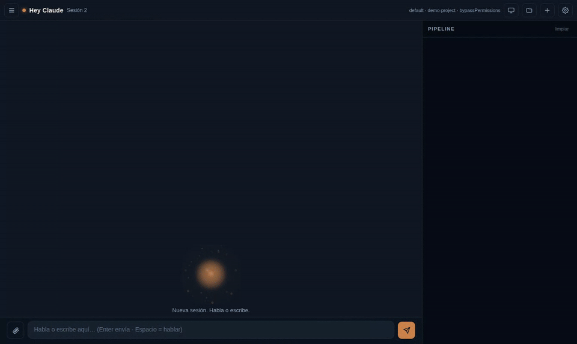

# Hey Claude 🎙️

**Talk to Claude Code. Hands-free. From your browser. Zero API keys.**

Say *"Hey Claude"* out loud — your agent chimes, listens, and gets to work on your codebase while you watch every step of its reasoning in a live pipeline. It can even rewrite **its own interface** when you ask it to.

> 🇪🇸 [Léeme en español](README.es.md)



## Why this is different

| | Hey Claude | Claude Code voice mode | IDE assistants |
|---|---|---|---|
| Wake word ("Hey Claude") | ✅ | ❌ push-to-talk | ❌ |
| **The agent can SEE your screen** (share screen; it looks mid-task when it needs to) | ✅ | ❌ | ❌ |
| Watch the agent think (live pipeline of every Read/Edit/Bash) | ✅ | ❌ | ❌ |
| The agent can rewrite its own UI by voice | ✅ | ❌ | ❌ |
| Works headless on a VPS (Tailscale/SSH) | ✅ | ❌ | ❌ |
| Browser STT/TTS — no API keys, $0 | ✅ | ✅ | ❌ |

- **Hands-free**: enable *Hey Claude* in settings, leave the tab in the background, and just talk. Activation chime + orb flare + desktop notification.
- **It sees your screen**: hit the screen button and share a window or your desktop (same picker as Meet/Zoom). Every command you speak includes a fresh frame of what you're looking at — *"Hey Claude, what's this error?"* just works. And the agent can **look again on its own** mid-task (it requests a fresh capture through the bridge when it needs one).
- **See your agent think**: a real-time pipeline shows every tool call (file reads, edits, shell commands, sub-agents) with per-step duration — like watching Claude Code's terminal, but beautiful.
- **It manages itself**: on boot it injects context into your project's `CLAUDE.md`, so Claude knows this web UI exists and can modify it when you ask ("make the orb bigger") — the agent edits its own code.
- **Full control**: review-before-send dictation (or auto-send), a Stop button that aborts the agent mid-reasoning, sessions with history, file explorer, drag-and-drop attachments.
- **Zero cost on top of your Claude subscription**: speech recognition and voices come from the browser (Web Speech API). The brain is your already-authenticated `claude` CLI.

## What you can do with it

It's **Claude Code, natively, by voice** — running inside a real workspace, so it doesn't just answer, it *builds*.

- **Ship a project by talking.** *"Create a landing page with a pricing section and deploy it."* It writes the files, runs the commands, and tells you when it's live — you watch every step in the pipeline.
- **Get unstuck on code, hands-free.** *"Read this module and tell me why the test is failing."* Perfect for thinking out loud while you pace the room.
- **Let it see what you see.** Share your screen and it reads the actual error on your monitor, helps with a visual or design project, reviews a UI as you scroll — or just plays along: share a game and have it strategize, narrate, or react to what's happening.
- **Build while you live.** Cook, walk, sketch — and keep a builder running in the background that turns sentences into working software.

Because it runs in *your* folder with *your* `CLAUDE.md` and skills, anything Claude Code can do, it can now do by voice.

## Quick start

Requirements: [Node.js 18+](https://nodejs.org), [Claude Code CLI](https://docs.anthropic.com/en/docs/claude-code) (`npm install -g @anthropic-ai/claude-code`, logged in), Chrome or Edge.

```bash
# 1. Drop the folder into your project root
git clone https://github.com/Setroc95/hey-claude.git
cd your-project && cp -r ../hey-claude .

# 2. Start it
bash hey-claude/start.sh        # Windows: double-click start.bat

# 3. Open http://localhost:8765 in Chrome/Edge
#    → gear icon → enable "Hey Claude" → talk.
```

> **Already use Claude Code in VS Code?** You're logged in — the CLI shares that session, so there's **no re-login**. And `start.bat` / `start.sh` will auto-install Node.js and the Claude Code CLI for you if they're missing.

The server runs `claude` in the **parent folder** (your project), so it inherits your `CLAUDE.md`, skills and MCP setup. Want a different project? Open settings → **System** → **Browse** and pick any folder — the agent restarts in that workspace and keeps its context there.

## Models

You pick the model from settings → **System** the same way `/model` works in the CLI: the options are the **real CLI aliases** — `default` (your account's default), `opus`, `sonnet`, `haiku` — plus a free-text field for any exact model name. Nothing invented: it resolves to whatever your installed Claude Code version offers.

## Honest limits & safety (read this)

- **Prompt injection is real.** The agent reads untrusted things — your shared screen, attached files, the contents of your workspace. A malicious instruction hidden in any of them could make the agent run commands or leak data. Default permission mode is `bypassPermissions` (full autonomy — that's what makes it powerful), so **run it on code/projects you trust**. For untrusted code use `plan` (read-only) from settings → System; `acceptEdits` is a middle ground (note: in this non-interactive mode it can restrict shell use). The `VOICE_TRIPWIRE=1` flag adds best-effort detection of obviously destructive commands, but it is *not* a sandbox.
- **No auth by default — keep it on localhost.** Every endpoint is unauthenticated and the server binds `127.0.0.1` only, which is safe locally. If you expose it (Tailscale Serve, a tunnel, `VOICE_HOST=0.0.0.0`), **set `VOICE_TOKEN=<secret>`** and open the URL with `?token=<secret>` — otherwise anyone who can reach it gets a no-auth agent that runs commands as you. Never use `tailscale funnel` (public internet) without a token.
- The wake word uses the browser's speech recognition: **keep the tab open** (it can be unfocused/backgrounded). The mic indicator stays visible — that's a browser security requirement, not a bug.
- Chrome/Edge speech recognition is cloud-backed by Google/Microsoft; offline it degrades.
- Mobile wake word is experimental (Android replays a system beep on each engine restart).
- On boot it writes a small marked block into your project's `CLAUDE.md` (so the agent knows this UI exists). It's idempotent; disable with `VOICE_NO_CLAUDEMD=1`.

## Configuration

| Env var | Default | Purpose |
|---|---|---|
| `VOICE_PORT` | `8765` | Port |
| `VOICE_MODEL` | `default` | `default`/`opus`/`sonnet`/`haiku` (CLI aliases) or a full model name |
| `VOICE_PERMISSION_MODE` | `bypassPermissions` | `plan` (read-only) / `acceptEdits` / `bypassPermissions` |
| `VOICE_TOKEN` | _(none)_ | If set, every request requires it — **use this when exposing remotely** |
| `VOICE_TRIPWIRE` | `0` | `1` = best-effort detection of destructive commands |
| `VOICE_WORKSPACE` | parent dir | Where Claude runs |
| `VOICE_NO_CLAUDEMD` | `0` | `1` = don't write the context block into `CLAUDE.md` |

Everything here is also changeable live from settings → **System** (model, permission mode, workspace), persisted in `voice-config.json` (which takes precedence over env vars on the next boot).

## Architecture

```
Browser (mic + speakers, Web Speech API)
   │  text                       ▲ sentences
   ▼                             │
server.js (Node, zero deps) ─────┤
   │  stream-json (hot process)  │ SSE /proc → live pipeline
   ▼                             │
claude CLI (your subscription, your project, your CLAUDE.md)
```

One Node file, one HTML file. No build step, no dependencies, no telemetry.

## Remote / VPS usage

Run it on a headless server and reach it securely with [Tailscale Serve](https://tailscale.com/kb/1312/serve) (`tailscale serve --bg --https=443 http://127.0.0.1:8765`) or an SSH tunnel (`ssh -L 8765:localhost:8765 user@host`). HTTPS/localhost is required for mic access.

⚠️ **Exposing it = set a token.** The moment it's reachable beyond localhost, start it with `VOICE_TOKEN=<secret>` and open `https://your-host/?token=<secret>`. Without it, anyone on your tailnet (or the internet, via funnel) gets an unauthenticated agent that runs commands as you.

## Roadmap

This is the beginning. What's coming:

- **Mobile companion over Tailscale** — drive your PC's dev environment from your phone, anywhere. Code on your commute, at the gym, away from the desk: you speak, and the machine back home builds it.
- More integrations, more UI languages, optional on-device speech, and pluggable wake-word engines.

Ideas and PRs shape what ships next.

## Contributing

PRs welcome — see [CONTRIBUTING.md](CONTRIBUTING.md). Good first issues: more languages for the UI, Firefox/Safari STT fallbacks, local Whisper STT, wake-word engines (Porcupine WASM opt-in).

## Why this exists

For fifty years the keyboard has sat between what we imagine and what we ship. We think in ideas and type in syntax — and as the models got faster, the bottleneck stopped being the machine and became the act of typing.

Hey Claude is an attempt to take that wall down. You talk, you point your screen at the problem, and an agent that actually *does things* builds alongside you — no IDE to open, no hands on the keys. It started as a tool I wanted for myself and turned into something I think a lot of people need: a way to create that fits around your life instead of chaining you to a desk.

It's open source on purpose. How we talk to our computers shouldn't belong to one company — it should belong to whoever wants to build it. If that resonates, [open a PR](CONTRIBUTING.md). Every contribution pushes the whole idea forward.

If it saved you time or made you smile, a ⭐ genuinely helps it reach the next person.

## License

[MIT](LICENSE)
